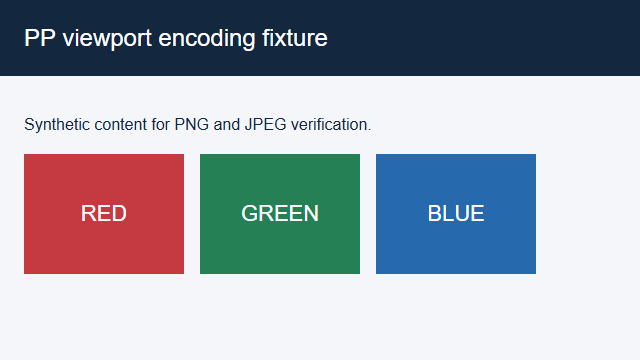

# Browser screenshot format evidence

Windows x64, bundled agent-browser 0.27.0. The synthetic page and isolated headless Chrome profile contain no private workspace content. These are original, unedited screenshot files.

The old Orca wrapper omitted the helper format option. Requesting JPEG therefore returned PNG bytes labeled JPEG. The helper fixture below isolates the encoding contract: its default output is PNG; adding `--screenshot-format jpeg` produces JPEG. The default and explicit PNG captures have identical hashes.

| Real helper command | File signature | Bytes |
| --- | --- | --- |
| `screenshot` | `89504e470d0a1a0a` (PNG) | 11423 |
| `screenshot --screenshot-format jpeg` | `ffd8ff` (JPEG) | 16074 |
| `screenshot --screenshot-format png` | `89504e470d0a1a0a` (PNG) | 11423 |

## Helper default (PNG)

## Helper with JPEG requested

The images have the same layout; their byte encoding is the behavior under test. The session was closed and no matching owned browser/helper processes remained. Source patch `4ba04fe94ee5b02364e8dcd6ba70fc5945ba053c` has four baseline regression failures and seven passing repaired/adjacent tests, a passing Node typecheck, and passing targeted lint/format checks. Full-suite/build and installed-Orca adoption are not claimed. The separately observed full-page repetition defect remains unresolved.

See [observations.json](observations.json) for exact hashes and scope.
