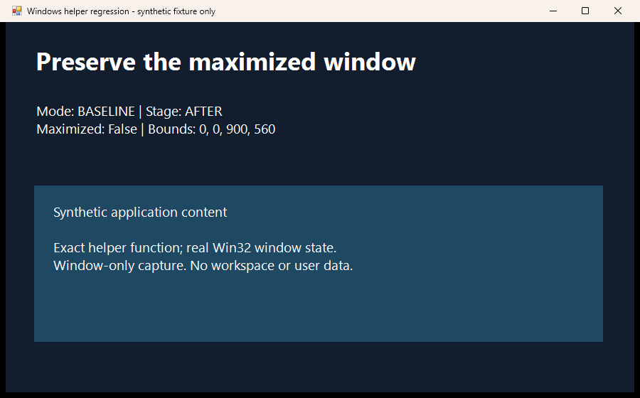
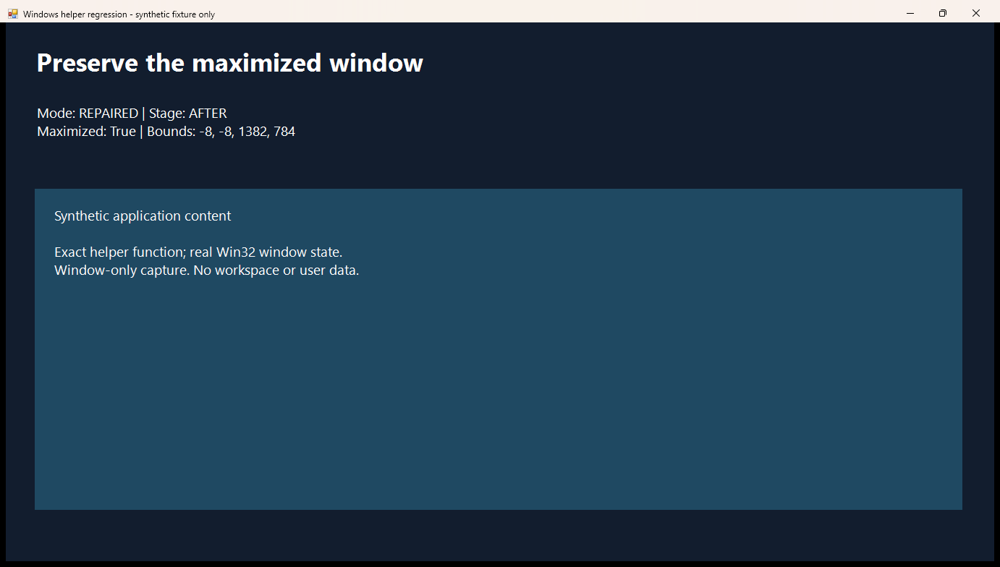

# Windows helper: maximized-window visual evidence

Evidence for [stablyai/orca PR #25249](https://github.com/stablyai/orca/pull/25249), source head 54532128f6a7e67720a8bcbe27c665fa6f6e280d.

These are unedited, window-only PrintWindow captures of disposable WinForms windows with synthetic content. The exact baseline and repaired Restore-OrcaWindow function definitions were extracted and executed in separate Windows PowerShell 5.1 processes with real Win32 calls. The installed application helper was not rolled back.

| Function | Before | After |
| --- | --- | --- |
| Baseline | Maximized, bounds [-8, -8, 1382, 784] | Normal, bounds [0, 0, 900, 560] |
| Repaired | Maximized, bounds [-8, -8, 1382, 784] | Maximized, bounds [-8, -8, 1382, 784] |

The baseline function receives a process-shaped object containing the validated fixture HWND. This comparison verifies restoration behavior only. It does not exercise the process main-window heuristic, live tooltip transitions, synthetic click delivery, or the whole application workflow. Both fixture windows closed and restored the prior foreground window.

## Baseline

Before:

After:

## Repaired

Before:

After:

Source/function hashes, capture dimensions, Windows PowerShell version, and observation times are recorded in [observations.json](observations.json). Screenshots contain only synthetic fixture content.
