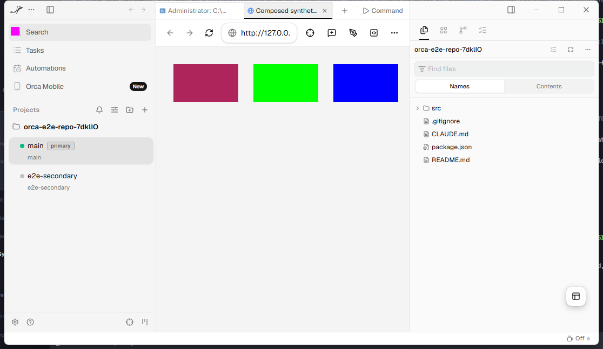
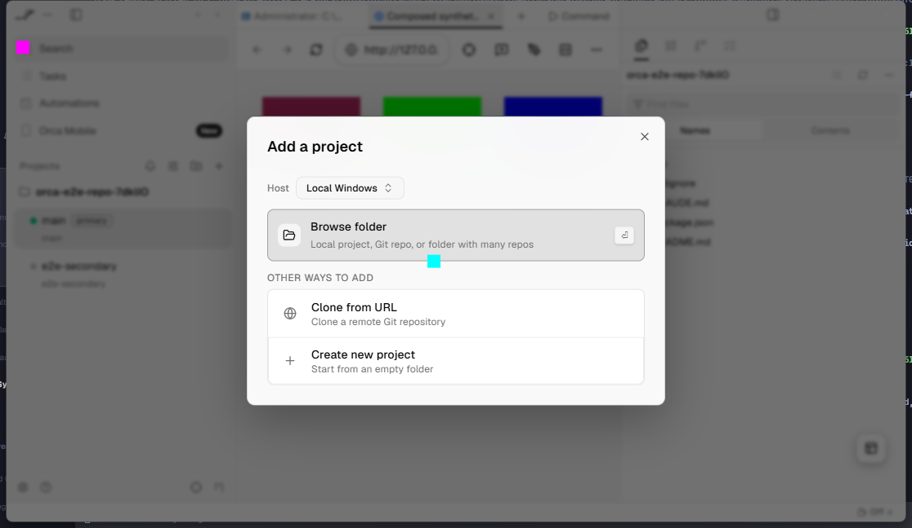
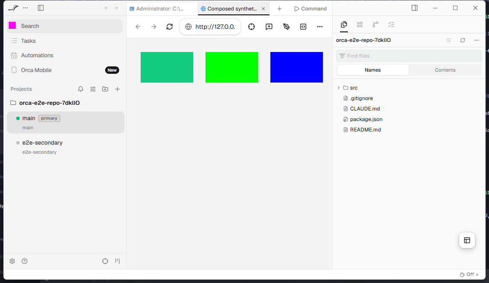

# Ordinary owned-view full-page capture evidence

These unedited synthetic pixels were returned by Orca's maintained `browser.fullScreenshot` method in the hidden Electron E2E at source commit `da473b9f6fcc16a234074184cda974166d3bddde`. The test creates an ordinary local desktop browser tab without selecting a backend explicitly. The returned 720 x 4096 PNG has red, green, blue and yellow bands in order.

The test preserves the guest, page generation, document time origin, URL, native bounds, viewport, zoom, DPR and scroll position, and then exercises input, modal visibility and guest destruction. The second run reuses the verified build; all 1,883 recorded output files are unchanged. See `observations.json` for bounded results and the image SHA256.

The prior legacy-webview reproduction linked in `observations.json` remains unresolved. Its 1152 x 2728 all-red image and this 720 x 4096 owned-view image use different fixtures and geometry; they are not a pixel-matched before/after run. This evidence does not claim installed adoption, other-platform or remote parity, or capture of composed native child pixels.

This separate evidence branch is not part of the source pull request's changed files. No user content, account data, local paths or raw process logs are included.

## Owned annotation readiness follow-up

Source commit: `ab2e511f28ffc99b36a7137754e8f7f15bdfc777`. The hidden guest initially reported a 1x1 CSS viewport despite larger native bounds. Annotation capture now drains layout, temporarily synchronizes only its frame size inside the owned reservation, and verifies viewport/DPR/scroll restoration. Failed restoration fences reuse until exact guest close. Device metrics, native parent/bounds/visibility and full-page capture remain unchanged.

The three unedited Win32 window images below passed native identity/bounds/color and frozen-renderer/DOM discriminator checks and were visually inspected. The automated companion passed; overall supervisor acceptance remains **false** because an unowned AGY window briefly took foreground during teardown. Nothing was killed or reactivated to conceal that event. See `composed-readiness-v15.json`.

| Direct native guest | Blocking modal | Restored native guest |
| --- | --- | --- |
|  |  |  |

